# PAGE_TESTING.md

This document defines the **pages** the Baby Steps app will implement and waht is required to (1) render them correctly and (2) test them consistently.

---
## Conventions Used in This Document

### Parameter Types
- **Route params**: values embedded in the URL path (e.g.,
`/child/:child_id`)
- **Query params**: values after `?` in the URL (e.g., `?
tab=tasks`)
- **State params**: values passed through navigation state
(optional; avoid for critical data)
### Data Types

- **Auth state**: current user identity + session token
- **Database data**: data fetched from the database
- **UI state**: transient values like form fields, selected
filters, toggles
### Mockups
- Each page includes a screenshot from our Figma document.

---

# 1) Welcome Page

## Page Title
Welcome

## Page Description
Has a basic welcome message and title, and buttons to either create a new account or log in with a pre-existing account.

## Mockup
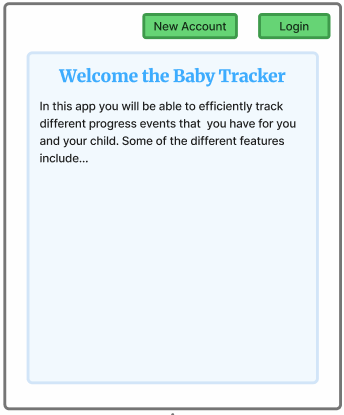

## Parameters needed for the page
None

## Data needed to render the page
None

## Link destinations for the page
- "New Account" to take user to Registration page → `/register`
- "Login" to take user to Login page → `/login` (GET request)

## Tests for Verifying Rendering of the Page
- **Welcome message renders**: Welcome message and description is displayed on the screen when the page is loaded
- **Submit button present**: Login button is visible and navigates to `/login`
- **Link to registration**: "New User?" link is visible and navigates to `/register`

# 2) Login

## Page Title
Login

## Page Description
This page allows users to log in to their account using their email and password. It includes form validation and error handling for incorrect credentials.

## Mockup
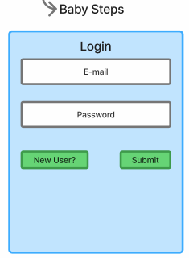

## Parameters needed for the page
- URL query params :
  - `error` to display error messages for unauthorized access (e.g., `?/login?error=You+are+not+authorized+to+access+this+page`)

## Data needed to render the page
None, as the user is not authenticated yet and no data is need to render the form.

## Link destinations for the page
- "New User?" to take user to Registration page → `/register`
- Submit button to submit login form → `/login` (POST request)

## Tests for Verifying Rendering of the Page
- **Form fields render**: Email and password input fields are displayed
- **Submit button present**: Login button is visible and enabled
- **Link to registration**: "New User?" link is visible and navigates to `/register`
- **Submit button posts form**: Clicking submit sends a POST request to `/login` with email and password
- **Error handling**: Incorrect credentials show an error message
- **Successful login**: Correct credentials redirect to user dashboard. Session data should be set to keep user logged in.

# 3) Register User

## Page Title
Sign Up

## Page Description
Allows new users to create an account by providing their name, email, and password. Includes form validation and error handling for missing fields, existing email addresses, and failed password confirmation.

## Mockup
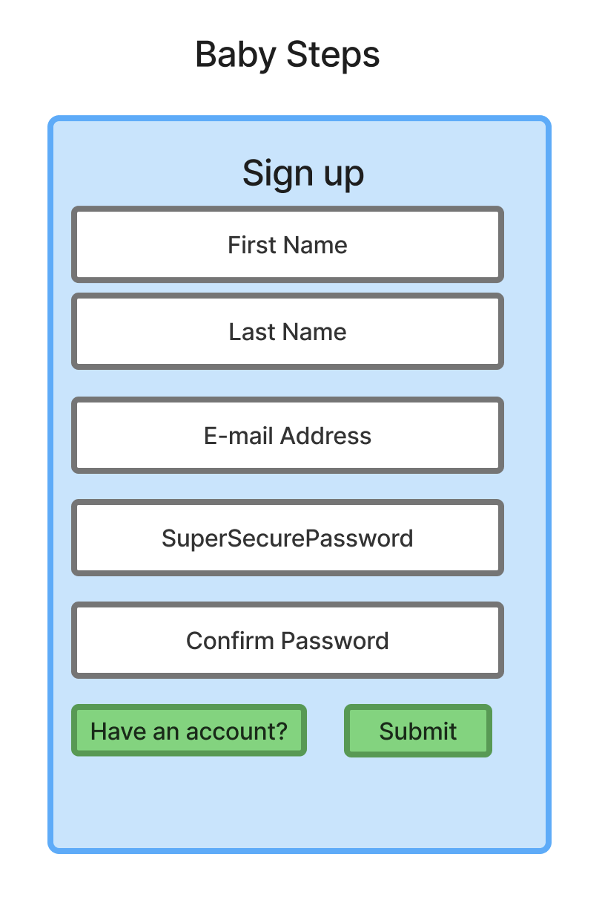

## Parameters needed for the page
None

## Data needed to render the page
None, as the user is not authenticated yet and no data is need to render the form.

## Link destinations for the page
- "Have an account?" to take user to Login page → `/login`
- Submit button to submit registration form → `/register` (POST request)

## Tests for Verifying Rendering of the Page
- **Form fields render**: First name, last name, email, password, and confirm password input fields are displayed.
- **Submit button present**: Sign Up button is visible and enabled.
- **Link to login**: "Have an account?" link is visible and navigates to `/login`.
- **Submit button posts form**: Clicking submit sends a POST request to `/register` with the form data.
- **Error handling**: Missing fields, existing email, and password confirmation errors show appropriate error messages.
- **Successful registration**: Correct form submission creates the user, logs them in, and redirects them to user dashboard. Session data should be set to keep user logged in.

# 4) User Landing Screen

## Page Title
User Dashboard

## Page Description
Purpose: View and click into children and/or add feeding events or more children.

## Mockup
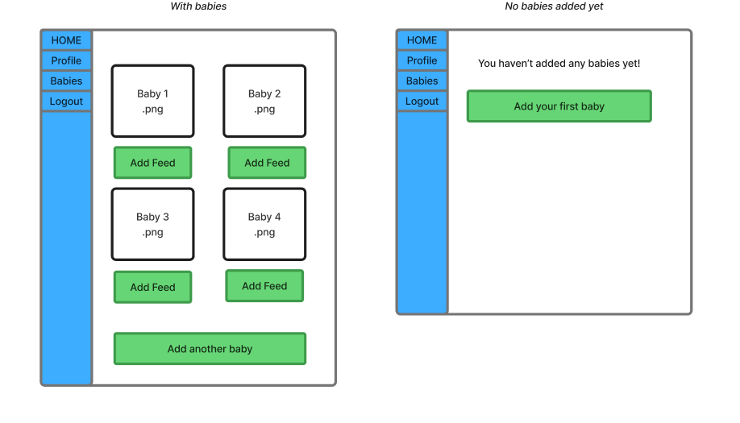

## Parameters needed for the page
- Route params: 
  - `user_id` (required) from `/user/<int:user_id>/dashboard`
- Query params (optional): 
  - `user_id`

## Data needed to render the page
- Auth state: current user id
- Database data:
  - User data
  - Child data

## Link destinations for the page
- HOME click → `/user/:user_id/dashboard`
- Profile → `/user/:user_id`
- Logout → `/logout`
- Edit → `/child/:child_id/edit`
- Child card/section → `/child/<int:child_id>`
- Add another baby → `/child/new`
- Add Feeding Event → `/feeding-event`

## Tests for Verifying Rendering of the Page
1. **Route param required**
   - Visiting `/dashboard/` without `user_id` shows error or redirects
2. **User header renders**
   - User name and information is displayed

3. **child information renders**
   - If children related to parent/user exists, it is displayed
   - If no feeding info exists , "No children to show " is displayed
4. **Child info only available to this Child's parent**
   - Non-parents cannot access (redirect or “access denied”)
6. **Links**
   - Clicking onto a child card directs the user to `/child/<int:child_id>`
   - “Add Feeding Event” navigates to `/feeding-event/new`

# 5a) Add baby form

## Page Title
Add or Edit Baby Profile

## Page Description
Purpose: Allows a logged-in parent to add a new child profile 

## Mockup
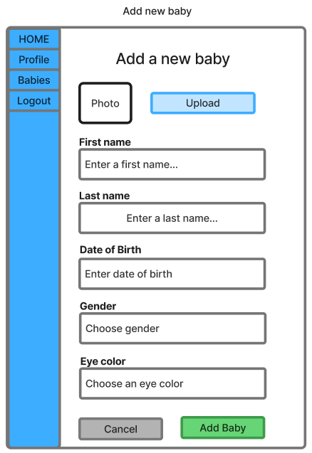

## Parameters needed for the page
Auth state: current user_id (required to associate the new child with the parent)

## Data needed to render the page
Auth state: current user id

## Link destinations for the page
- HOME click → /user/:user_id/dashboard
- Profile → /user/:user_id
- Logout → /logout
- Save (form submit) → /child (POST), redirects to /child/:child_id on success

## Tests for Verifying Rendering of the Page
1. Child data is rendered — Name, DOB, sex, and eye color fields are displayed
2. Submit button present — Save button is visible and enabled
3. Only accessible to logged-in users — Unauthenticated users are redirected to /login
4. Successful submission — Valid form data creates a new child profile and redirects to /user/:user_id/dashboard
5. Error handling — Missing required fields show appropriate error messages
     
# 5b) Edit Baby Form
## Page Title
Edit Baby Profile

## Page Description
Purpose: Allows a logged-in parent to edit a pre-existing child profile 

## Mockup
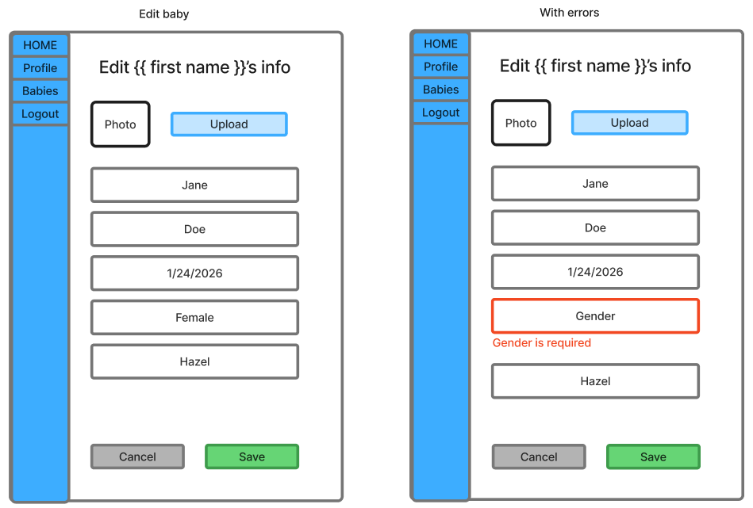

## Parameters needed for the page
- Auth state: current user_id (required to associate the child with the parent)
- Route params: child_id (required) from /child/:child_id/edit

## Data needed to render the page
- Auth state: current user id
- Database data: existing child data

## Link destinations for the page
- HOME click → /user/:user_id/dashboard
- Profile → /user/:user_id
- Logout → /logout
- Save (form submit) → /child/:child_id (PATCH), redirects to /child/:child_id on success

## Tests for Verifying Rendering of the Page
1. Route param required — Visiting /child/edit without child_id shows error or redirects
2. Form pre-populates — Existing child data (name, DOB, sex, eye color) is pre-filled in the form
3. Only accessible to this child's parent — Non-parents are redirected or shown "access denied"
4. Submit button present — Save button is visible and enabled
5. Successful submission — Valid edits update the child profile and redirect to /child/:child_id
6. Error handling — Missing required fields show appropriate error messages

# 6) View User Profile

## Page Title
View User Profile

## Page Description
View a user's info, and have an option to navigate to the page to edit.

## Mockup
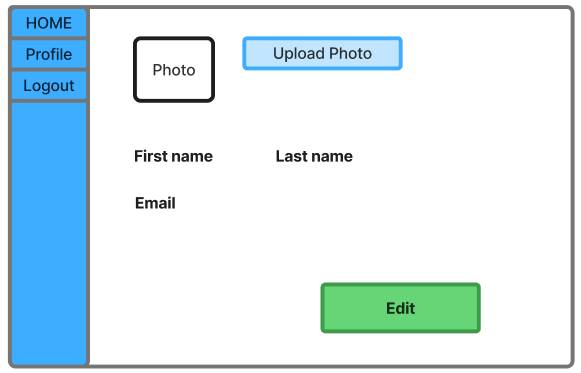

## Parameters needed for the page
- Route params: 
  - `user_id` (required) from `/user/:user_id`
- Query params (optional): none

## Data needed to render the page
- Auth state: current user id
- Database data:
  - User data
  - User photo
- UI state:
  - Selected user data and photo

## Link destinations for the page
- HOME click → `/user/:user_id/dashboard`
- Profile View → `/user/:user_id` (GET request)
- Logout → `/logout`
- Upload Photo → `/user/:user_id/photo` (POST request)
- Edit User page → `/user/:user_id/edit` (GET request)

## Tests for Verifying Rendering of the Page
1. **Route param required**
   - Visiting `/user/` without `user_id` shows error or redirects
2. **User header renders**
   - User name is displayed
3. **User data renders**
   - User first and last name and email are displayed, and password is initially not visible
4. **Edit button enables editing**
   - Pressing “Edit” navigates to the Edit User Info page, with editable fields
5. **Photo**
   - If a user has a photo, it is displayed
   - Pressing “Upload” opens a pop-up so the user can select a photo to upload and associate with this user

# 6B) Edit User Profile

## Page Title
Edit User Profile

## Page Description
Edit a user's info, and have an option to save and navigate back to the view page.

## Mockup
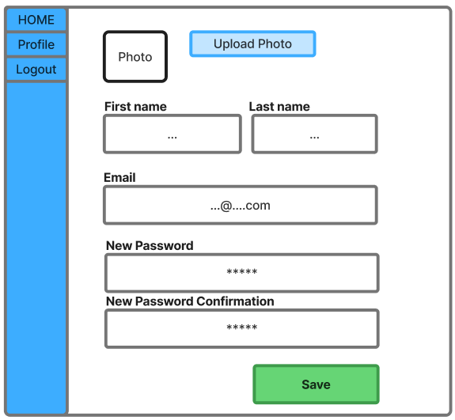

## Parameters needed for the page
- Route params: 
  - `user_id` (required) from `/user/:user_id/edit`
- Query params (optional): none

## Data needed to render the page
- Auth state: current user id
- Database data:
  - User data
  - User photo
- UI state:
  - Selected user data and photo

## Link destinations for the page
- HOME click → `/user/:user_id/dashboard`
- Profile View → `/user/:user_id` (GET request)
- Logout → `/logout`
- Upload Photo → `/user/:user_id/photo` (POST request)
- User Info Update (Save) → `/user/:user_id` (PATCH request)

## Tests for Verifying Rendering of the Page
1. **Route param required**
   - Visiting `/user/` without `user_id` shows error or redirects
2. **User header renders**
   - User name is displayed
3. **User data renders**
   - User first and last name and email are displayed, and password is initially not visible
4. **Save button functionality**
   - If the save button is pressed and input is valid, the user is updated and the UI returns to the view user info page, with user info as text labels instead of input fields, and password fields are hidden
   - If the save button is pressed and the password is changed, and the New Password and New Password Confirmation fields have different contents, an informative error will appear and the save will not be completed
5. **Photo**
   - If a user has a photo, it is displayed
   - Pressing “Upload” opens a pop-up so the user can select a photo to upload and associate with this user

# 7) Child Profile

## Page Title
Child Profile

## Page Description
Purpose: view Child info, and view feeding events.

## Mockup
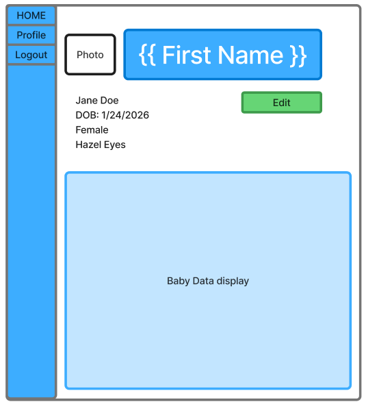

## Parameters needed for the page
- Route params: 
  - `child_id` (required) from `/child/:child_id`
- Query params (optional): none

## Data needed to render the page
- Auth state: current user id
- Database data:
  - Child data
  - Child event data
- UI state:
  - Selected Child user info and data
  - Visualization - Table or Chart

## Link destinations for the page
- HOME click → `/user/:user_id/dashboard`
- Profile → `/user/:user_id`
- Logout → `/logout`
- Edit → `/child/:child_id/edit`
- Add Feeding Event → `/feeding-event`

## Tests for Verifying Rendering of the Page
1. **Route param required**
   - Visiting `/child/` without `child_id` shows error or redirects
2. **Child header renders**
   - Child name + child information is displayed
3. **Feeding information renders**
   - If feeding info for this child exists, it is displayed
   - If no feeding info exists for this child, "No Feeding Data" is displayed
4. **Child info only available to this Child's parent**
   - Non-parents cannot access (redirect or “access denied”)
6. **Links**
   - “Edit” navigates to correct route or opens modal
   - “Add Feeding Event” navigates to correct route or opens modal

# 8) Feeding Events

## Page Title
Feeding Event

## Page Description
Purpose: Be able to log the time, date, amount, and description of a child's feed/meal.

## Mockup
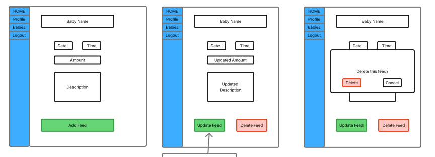

## Parameters needed for the page
- Route params: 
  - `/feeding-event/new` for new event
 
## Data needed to render the page
- Auth state: only available to logged in user
- Database data:
  - Child data
- UI state:
  - Selected Child info

## Link destinations for the page
- HOME click → `/user/:user_id/dashboard`
- Profile → `/user/:user_id`
- Logout → `/logout`
- Add Feeding Event → `/feeding-event`

## Tests for Verifying Rendering of the Page
1. **Child name renders**
   - Child name is displayed
2. **Only available if logged in**
   - Non-parents and logged out users cannot access (redirect or “access denied”)
  
# 9) Edit/Delete Feeding Event

## Page Title
Edit Feeding Event

## Page Description
Purpose: Be able to edit the time, date, amount, and description of a child's feed/meal or delete the event entirely.

## Mockup
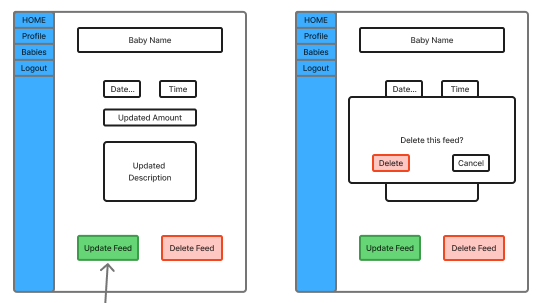

## Parameters needed for the page
- Route params: 
  - `/feeding-event/<int:event_id>/edit` for editing an existing event
- Query params (optional): none

## Data needed to render the page
- Auth state: only available to logged in user
- Database data:
  - Child data
  - Feed data if updating/deleting previous input
- UI state:
  - Selected Child info
  - Selected event info

## Link destinations for the page
- HOME click → `/user/:user_id/dashboard`
- Profile → `/user/:user_id`
- Logout → `/logout`
- Edit Feeding Event → `/feeding-event/<int:event_id>`
- Delete Feeding Event → `/feeding-event/<int:event_id>` (DELETE request)
  
## Tests for Verifying Rendering of the Page
1. **Route param required**
   - Editing: Visiting `/feeding-event` without `event_id` shows error or redirects
2. **Child name renders**
   - Child name is displayed
3. **Previous event renders**
   - Editing an existing event, the respective information for that event is displayed and able to be changed
4. **Only available if logged in**
   - Non-parents and logged out users cannot access (redirect or “access denied”)
5. **Save event**
   - Selecting to update an event, updates the information for that event in the database.
6. **Deletion removes event**
   - Deleting an event removes it permanently from the database