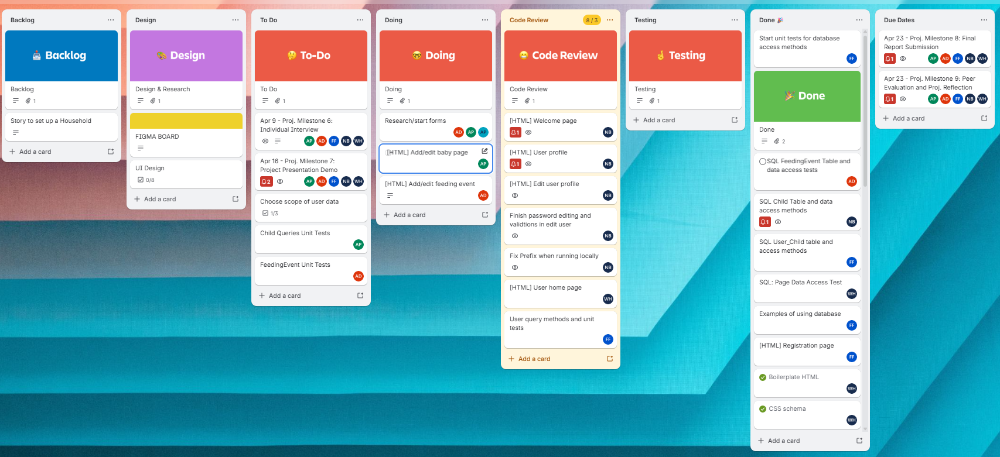
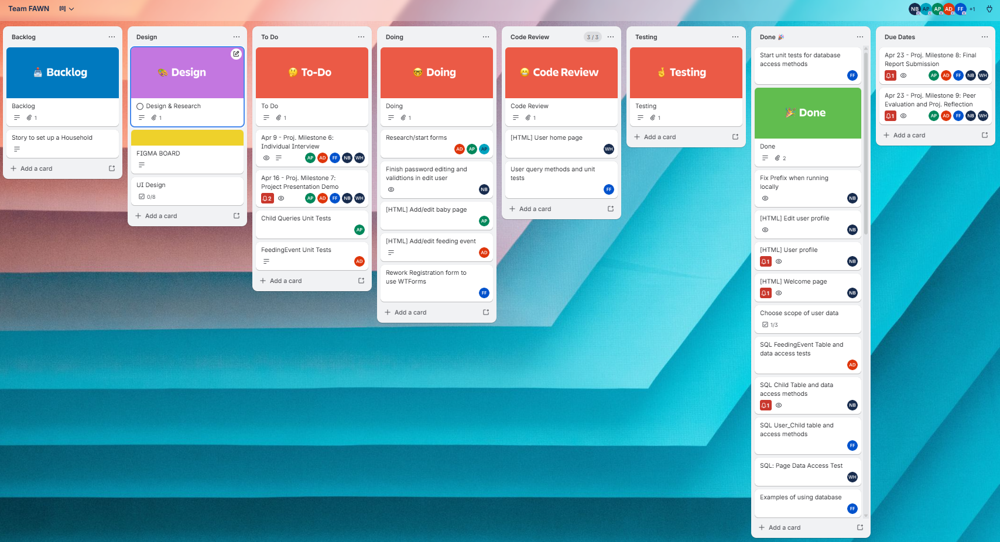
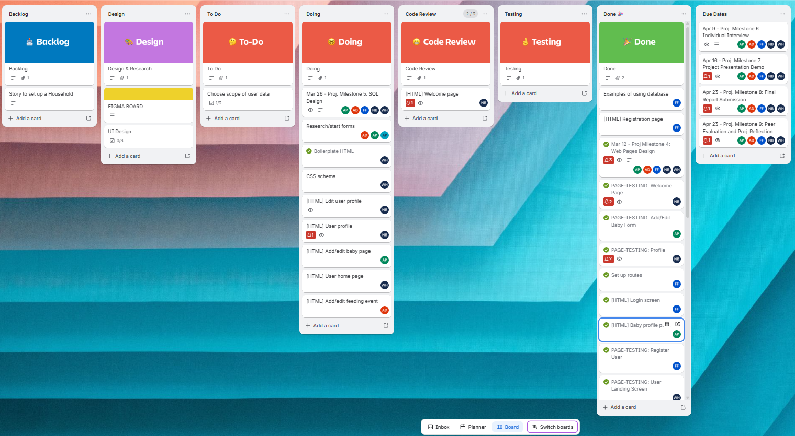
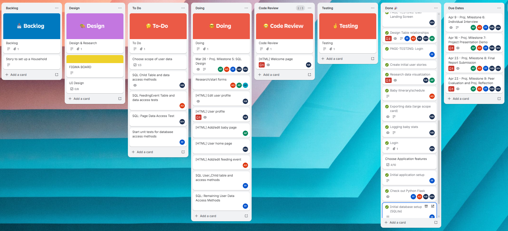
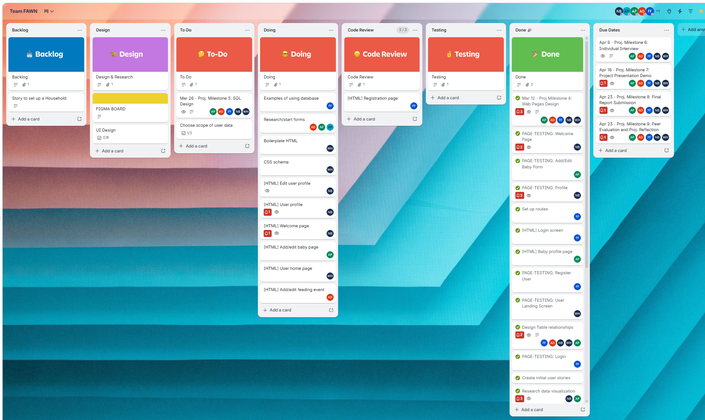
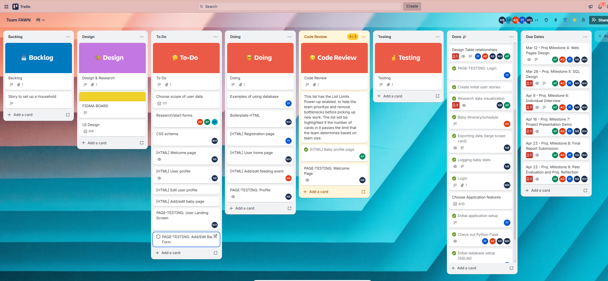
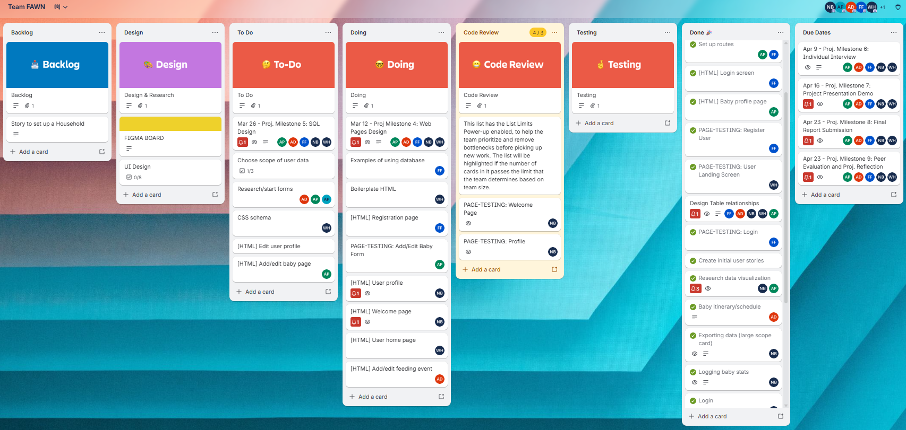
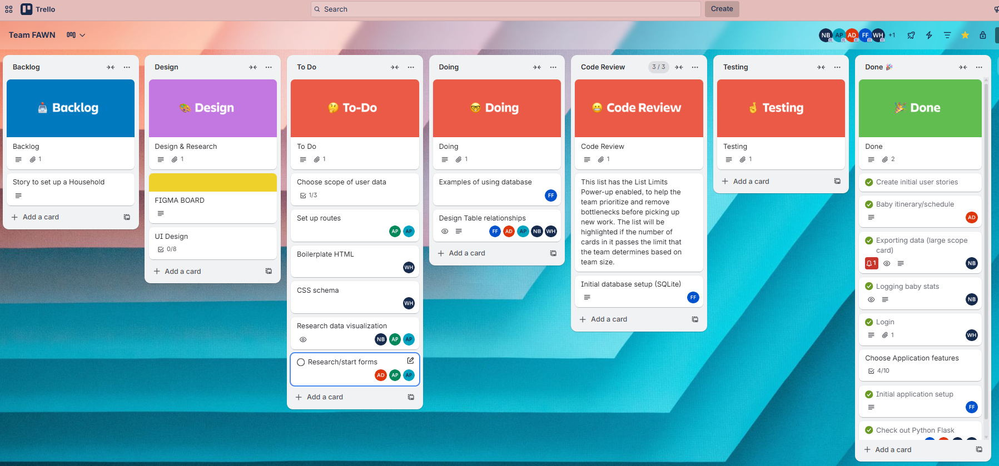
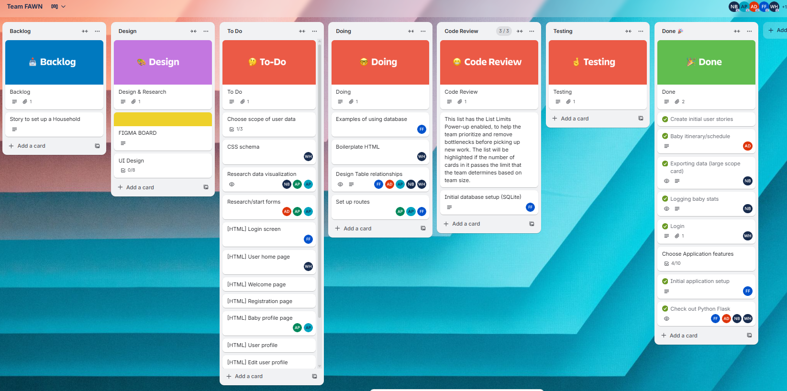

# WEEKLY_STATUS.md
## Project Milestone 3: Weekly Status Report

**Project:** Baby Steps

**Team Number:** 5

**Team Name:** FAWNA

## Overview
This document captures the **weekly status** of the Baby managing project for the specified reporting period. It is intended to provide a concise snapshot of progress, plans, and risks, and will be updated weekly throughout the project.

This weekly status format is designed to:
- Track ongoing progress over time
- Surface risks and blockers early
- Provide accountability for individual contributions
- Supplement the project management tool used by the team

---

## Reporting Period
**Week:** 10

**Meeting Held:** Yes

**Meeting Date:** April 1 standup and March 29 working session

**Meeting Duration:** 0.5 hours, 1 hour

**Meeting Format:** Zoom

---

## Project Management Snapshot

The team is using a shared **Trello board** to manage tasks and sprint progress.
At the time of the report:
- Columns include: Backlog, Design, To Do, Doing, Code Review, Testing, Done, Due Dates
- Tasks are assigned to one or more individual team member(s)

Before meeting:

After meeting:

## Progress Since Last Week

Key accomplishments include:
- Completed Milestone 5
- Initial testing framework in place
- Progress on pages

## Completed Tasks
- Testing framework setup
- Built out some tests
- prefix.py fixed, merged
- Merged updates for Dashboard and Feeding Event pages

## Tasks on deck
- Reviewing work on User pages
- Completing further work on Child pages and Feeding Event pages
- Adding more test coverage
- Refactor some forms to use WTForms

## Blockers and issues
- Some trouble integrating the base.html with feeding event pages

## Risks and Mitigation
- None

---

## Reporting Period
**Week:** 9

**Meeting Held:** Yes

**Meeting Date:** March 25 standup and working session

**Meeting Duration:** 1.5 hours

**Meeting Format:** Zoom

---

## Project Management Snapshot

The team is using a shared **Trello board** to manage tasks and sprint progress.
At the time of the report:
- Columns include: Backlog, Design, To Do, Doing, Code Review, Testing, Done, Due Dates
- Tasks are assigned to one or more individual team member(s)
Before meeting:

After meeting:

---

## Progress Since Last Week

Key accomplishments include:
- Continued work Milestone 5 document, on track to finish tomorrow
- Continued development of remaining pages

## Completed Tasks
- prefix module for running in c-sel

## Tasks on deck
- Finish SQL design doc
- Finish implementation of remaining pages
- Start work on unit tests

## Blockers and issues
- None

## Risks and Mitigation
- None

---

(Spring Break)

---

## Reporting Period
**Week:** 8

**Meeting Held:** Yes

**Meeting Date:** March 15 working session

**Meeting Duration:** ~2 hours

**Meeting Format:** Zoom

---

## Project Management Snapshot

The team is using a shared **Trello board** to manage tasks and sprint progress.
At the time of the report:
- Columns include: Backlog, Design, To Do, Doing, Code Review, Testing, Done, Due Dates
- Tasks are assigned to one or more individual team member(s)

As of 3/22/2026:

---

## Progress Since Last Week

Key accomplishments include:
- Started SQL design doc and discussed design strategies
- Started experiments with Flask Blueprint and WTForms features
- Progress on pages like User Dashboard

## Completed Tasks
- Pages
  - Registration
- Functionality
  - Logout handling

## Tasks on deck
- Finish SQL design doc
- Work on implementation of remaining pages

## Blockers and issues
- None

## Risks and Mitigation
- None

---

## Reporting Period
**Week:** 7

**Meeting Held:** Yes

**Meeting Date:** March 11 standup, March 8 working session

**Meeting Duration:** ? minutes, 2 hours

**Meeting Format:** Zoom

---

## Project Management Snapshot

The team is using a shared **Trello board** to manage tasks and sprint progress.
At the time of the report:
- Columns include: Backlog, Design, To Do, Doing, Code Review, Testing, Done, Due Dates
- Tasks are assigned to one or more individual team member(s)
- Due dates are now added!

Before meeting:

After meeting:

---
## Progress Since Last Week

Key accomplishments include:
- Nearing completion of page testing document
- User login implementation and navigation routes
- Progress on html templates

---
## Completed Tasks
- Page behavior documentation for testing:
  - Login
  - Register User
  - User Landing Screen
  - Child Profile
- Login authorization
- Common components
  - Navigation side-bar
  - HTML/CSS reusable components

## Tasks on deck
- Page behavior documentation for testing:
  - (in PR) Welcome
  - Alana picking up Add/Edit baby form
  - (in PR) Profile
  - (in PR) Feeding Event view/add and edit/delete forms

## Blockers and issues
- May need to troubleshoot navigation when running app in c-sel environment (doesn't work yet just for Nate)
---

## Risks and Mitigation
- None

## Team Reflection
- Scope is feeling bigger than expected as we flesh out documentation, but making progress

## Individual Contributions This Week

- **Alana Powell** Full Child Profile html template page, refactor separating out css from html, testing documentation, established deadlines in Trello
- **Antonio Duran Jr** Testing documentation of Feeding Event page and progress on input forms, itemized testing documentation work in Trello
- **Felice Forby** Login/authorization code implementation with reusable component, testing documentation of Login and Registration pages
- **Nate Bliton** Testing documentation of Welcome and User Profile pages, progress on Welcome page HTML template, notes for this document
- **Will Hansen** Reusable HTML Sidebar component, boilerplate HTML and css content, User landing screen testing documentation

---

## Reporting Period
**Week:** 6

**Meeting Held:** Yes

**Meeting Date:** March 3 standup, Feb 28 working session

**Meeting Duration:** 30 minutes, 1.5 hours

**Meeting Format:** Zoom

---

## Project Management Snapshot

The team is using a shared **Trello board** to manage tasks and sprint progress.
At the time of the report:
- Columns include: Backlog, Design, To Do, Doing, Code Review, Testing, Done
- Tasks are assigned to one or more individual team member(s)
- No due dates expressed at this point, but may start doing that.

Before meeting:

After meeting:

---
## Progress Since Last Week

Key accomplishments include:
- Welcomed new team member Alana!
- Worked through Database Design and Page layout in Figma
- Initial implementation of database in Flask using SQLAlchemy
- Research on visualizations and forms
- Initial Jinja template experiments

---
## Completed Tasks
- Page design initial wireframes:
  - Welcome
  - Login
  - User Landing Screen
  - Add/Edit baby form
  - Profile
  - Child Profile
  - Feeding Event form
- Database table design
  - User
  - Baby
  - ParentChild
  - FeedingEvent

## Blockers and issues
- HTML template design is dependent on routes
- CSS might be tricky to work on separately, need to come up with a common theme
---

## Risks and Mitigation

Separate time zones is tricky for scheduling, but is working so far

## Team Reflection

- organization in group is going well
- coworking in Figma is effective
- each of us and then picking up individual research and implementation tasks is going well so far too

## Individual Contributions This Week

- **Alana Powell** Worked on wireframes in Figma, some research on visualization, initial work on Child Profile form
- **Antonio Duran Jr** Worked on wireframes in Figma, worked on rudimentary input form for baby Feeding Events page
- **Felice Forby** Worked on wireframes in Figma, and finished initial implementation of our database and tables in our Flask app
- **Nate Bliton** Created and worked on this document, helped with wireframes, and investigated visualization options some too
- **Will Hansen** Worked on wireframes in Figma, completed initial database table design in Figma, and worked through initial HTML templates in Jinja

---
## Notes
This file will be updated weekly as the project progresses.
Earlier weekly entries may be retained below or moved to an archive directory if
the file grows large.

We have set up two weekly meetings: Wednesday nights as our shorter standup, and Saturday mornings for longer working/discussion sessions.

Quick notes for those earlier meetings is below:

### 2026-02-07
- Initial meeting!
- Discussed stack, upcoming tasks
- brainstorm team name

### 2026-02-11
- made git repo and team name Fawn
- during meeting verified github merge rules and commits
- will brainstorm project ideas

### 2026-02-14
- We brainstormed possible features to discuss for the next meeting on 2/22

### 2026-02-22

- We each checked out Flask some
- established user stories
- divided up tasks for Wednesday

### 2026-02-26

- Recorded our "stand up meeting"
- Shared progress on Flask and establishing requirements
- Started using Figma for UI and database design
- Sent links to new team member Alana

### 2026-02-28

- Worked together through rough Wireframes for each page in Figmia
- Finished out Will's work on Database table design
- Planned to move weekend working session to 10am Mountain Time on Sundays

### 2026-03-04

- Gave standup-style updates
  - progress on Flask/Jinja implementation
  - completion of initial database implementation
- Discussed team-matters
  - team/project name update
  - meeting scheduling update, also moving Wednesday nights earlier to 5pm Mountain Time
- Added some more cards in Trello for page implementations
  - plan to pick them up at weekend meeting

### 2026-03-08

- Code updates
  - some intitial pages
  - initial navigation routes
  - login implementation
- Documentation
  - Started PAGE_TESTING.md with initial Child profile
- Established more tasks and divided up some of them

### 2026-03-11

- Code updates, PRs for testing document too
- Felice
  login page and page testing for login/registration
  no blockers, off next week
- Antonio
  worked on feeding event forms
  saw flask library for forms that Felice mentioned
- Alana
  created separate css file in static folder for styles, PR merged
- Will
  updates to block html and block stylesheet, PR merged
  fixed some links

### 2026-03-15
- Merged Alana's start on our SQL design doc, revised SQL diagrams and discussed relation strategy (sticking with current design for now)
- Merged Felice's PR with Registration page and Logout handling
- Reviewed Will's work in progress on User Dashboard
- Discussed possibility of refactoring app.py to use [Flask Blueprint](https://flask.palletsprojects.com/en/stable/blueprints/) objects to clean up the code
- Discussed adopting the [WTForms](https://flask.palletsprojects.com/en/stable/patterns/wtforms/) for input forms
- Likely won't meet mid week over spring break, next meeting likely following Sunday

### 2026-03-18
- Off for Spring Break

### 2026-03-22
- Off for Spring Break

### 2026-03-25
- Nate added prefix.py for c-sel and welcome page
- Felice did registration and login, may move on to adding unit tests
- Will did work on dashboard, ready for the next thing
- Antonio did work on forms for feeding event, continuing working on formatting and testing, integrating with base.html

### 2026-03-29
- Felice got started on testing stuff, use pytest instead of unit test, merged PR with framework setup and initial tests
- Will demoed work on dashboard and more integration, merged
- Nate demoed progress on user pages and csel prefix.py, merged with help from team, next working on password update and fixing local run problem with prefix
- Alana progress on child pages, will work on child data access tests too
- Antonio demoed add/edit feeding event pages, merged

### 2026-04-01
- Alana - working on unit tests and html page for adding/editing baby profile, working from other html examples
- Will - working on cleaning up css, picking up working on unit tests that aren't picked up yet
- Felice - PR for user unit tests - create, get by email and id, update
- Antonio - working on his pages, working through integration of base.html
- Nate - worked on prefix bug and implementing update password. Got feedback on password, will update PR returning edit user GET and POST HTTP methods
- (planning to meet on Easter)